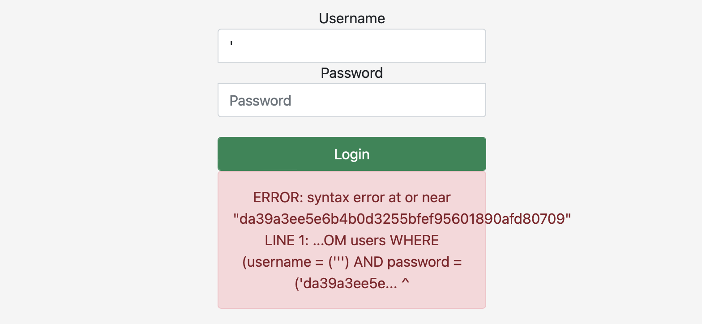
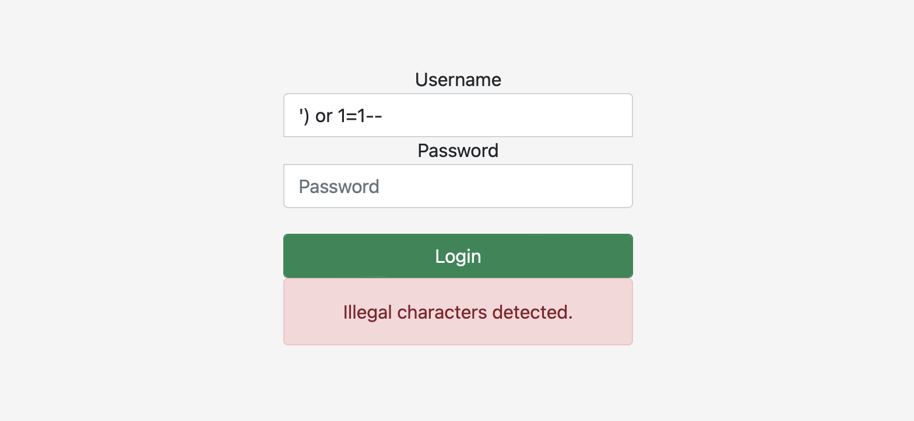
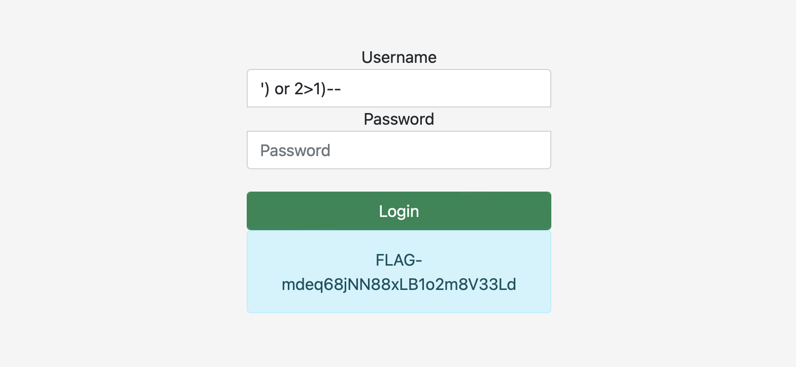

# Po po po po postgresql

## Challenge Details 

- **CTF:** RingZer0
- **Category:** SQL Injection
- **Points:** 2

## Provided Materials

- Login page

## Solution

We can cause the error by submitting `'` as username:



We can see now the full query:

```
...FROM users WHERE (username = ('our_username') AND ...
```

We can try now with `') or 1=1--` *(`--` is comments in `postgresql`)*:



We can then enter all the symbols one by one and understand, that only `=` is illegal. So we can try with `') or 2>1)--`:




## Final Flag

`FLAG-mdeq68jNN88xLB1o2m8V33Ld`

*Created by [bu19akov](https://github.com/bu19akov)*