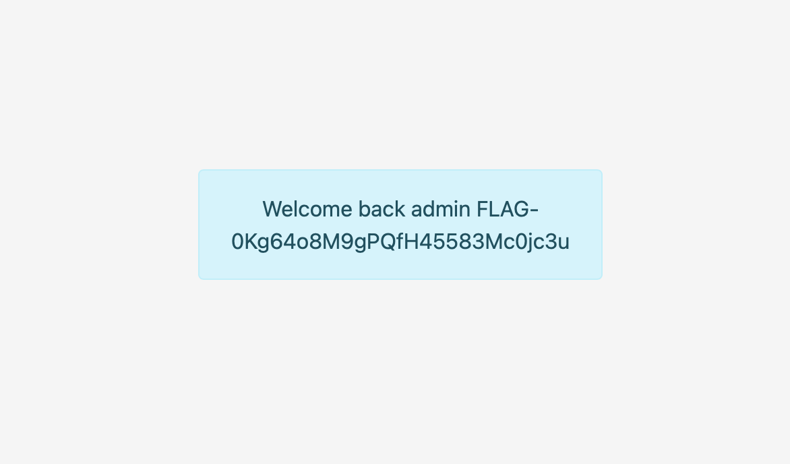

# Random Login Form

## Challenge Details 

- **CTF:** RingZer0
- **Category:** SQL Injection
- **Points:** 2

## Provided Materials

- Login and Registration forms

## Solution

We will perform [SQL truncation attack](https://resources.infosecinstitute.com/topics/hacking/sql-truncation-attack/). So if we try to register as `admin`, we will get message `This account already exists.`, but by default MySQL database column is limited to 20 characters, so if we register as

```sh
admin               a
```

*(admin and 15 spaces + a)*, our username will be truncated to 20 characters in database, so it will be just `admin` and the `a` at the end will be truncated, and the password will be rewriten.

So we can login with `admin` and new password and get the flag:



## Final Flag

`FLAG-0Kg64o8M9gPQfH45583Mc0jc3u`

*Created by [bu19akov](https://github.com/bu19akov)*