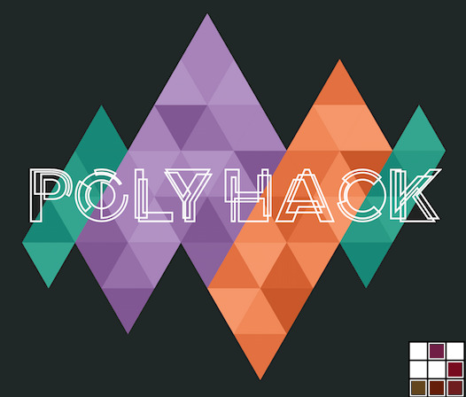
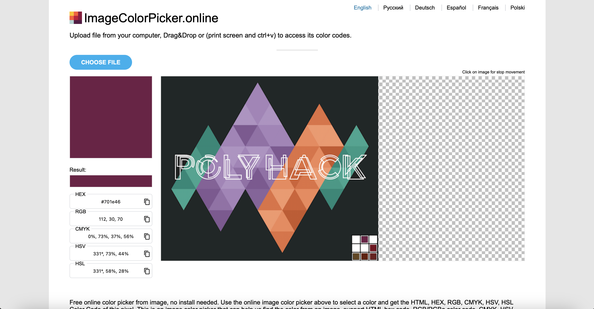

# 5 beautiful colors

## Challenge Details 

- **CTF:** RingZer0
- **Category:** Steganography
- **Points:** 3

## Provided Materials

- Image:



## Solution

The name of the challenge is `5 beautiful colors` and we can see in the right bottom corner 5 coloured squares, so we can use [ImageColorPicker](https://imagecolorpicker.online) to get the `rgb` colors:



As we can see the first color in `rgb` mode is `112, 30, 70`.

So, all the square colours in `rgb` mode will be:

```
112, 30, 70
119, 10, 30
100, 70, 30
101, 30, 10
110, 30, 30
```

The values for `red` *(first column)* look like `ASCII` values, so let's map them to `ASCII` values:

```
112 -> p
119 -> w
100 -> d
101 -> e
110 -> n
```

If we sort them in descending order, we will get:

```
112 -> p
119 -> w
110 -> n
101 -> e
100 -> d
```

## Final Flag

`pwned`

*Created by [bu19akov](https://github.com/bu19akov)*