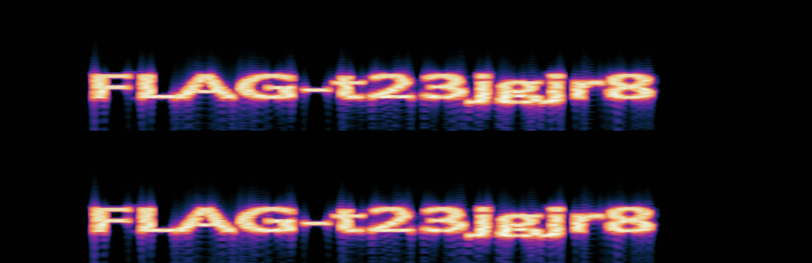

# A ghost sound

## Challenge Details 

- **CTF:** RingZer0
- **Category:** Steganography
- **Points:** 2

## Provided Materials

- Audio file

## Solution

As we play the audio file, we only hear strange noises. So we need to analyze it further with [Audacity](https://www.audacityteam.org). 
*(Audacity is the world's most popular free software for recording and editing audio.)* 

With `Audacity` we can analyze the audio files in [Spectogram View](https://manual.audacityteam.org/man/spectrogram_view.html#:~:text=To%20select%20Spectrogram%20view%2C%20click,required%20view%20can%20be%20selected..). 
*(To select Spectrogram view, click on the track name (or the black triangle) in the Track Control Panel which opens the Track Dropdown Menu, where the required view can be selected.)*

This shows us the flag:

## Final Flag

`FLAG-t23jgjr8`

*Created by [bu19akov](https://github.com/bu19akov)*

