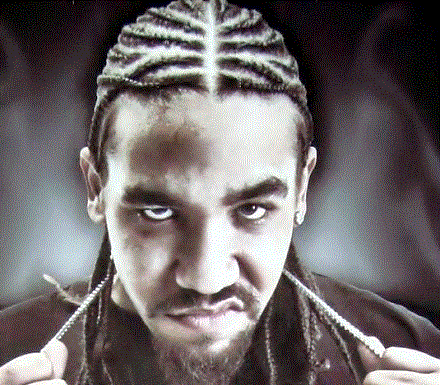
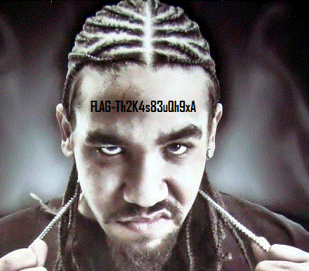

# Brainsick

## Challenge Details 

- **CTF:** RingZer0
- **Category:** Steganography
- **Points:** 2

## Provided Materials

- Gif file:




## Solution

We can see, that there is hidden `RAR archive` with [binwalk](https://www.kali.org/tools/binwalk/) *(tool for searching a given binary image for embedded files)*:

```sh
binwalk file.gif 

DECIMAL       HEXADECIMAL     DESCRIPTION
--------------------------------------------------------------------------------
0             0x0             GIF image data, version "89a", 440 x 385
78301         0x131DD         RAR archive data, version 4.x, first volume type: MAIN_HEAD
```

So we can use `-e` flag to extract it: `binwalk -e file.gif`. In the `RAR archive` we will find `flag.gif`:



## Final Flag

`FLAG-Th2K4s83uQh9xA`

*Created by [bu19akov](https://github.com/bu19akov)*

