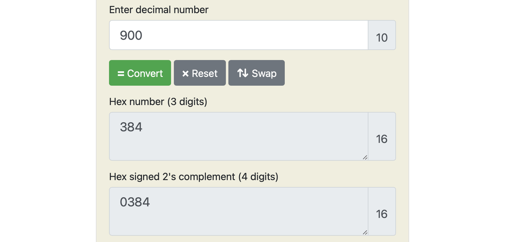
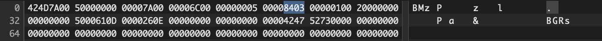
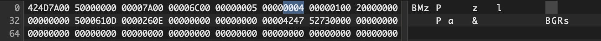

# Can you see through the matrix!

## Challenge Details 

- **CTF:** RingZer0
- **Category:** Steganography
- **Points:** 3

## Provided Materials

- Image:


## Solution

Analyzing the image, everything seems fine, but if we look closely on the output of [ExifTool](https://en.wikipedia.org/wiki/ExifTool) *(reading, writing, and manipulating image, audio, video, and PDF metadata)* we can notice:

```sh
$ exiftool file.bmp 
ExifTool Version Number         : 12.60
File Name                       : file.bmp
Directory                       : .
File Size                       : 5.2 MB
File Modification Date/Time     : 2020:03:16 14:01:00+01:00
File Access Date/Time           : 2024:01:20 18:36:40+01:00
File Inode Change Date/Time     : 2024:01:20 18:36:38+01:00
File Permissions                : -rw-r--r--
File Type                       : BMP
File Type Extension             : bmp
MIME Type                       : image/bmp
BMP Version                     : Windows V4
Image Width                     : 1280
Image Height                    : 900
Planes                          : 1
Bit Depth                       : 32
Compression                     : None
-> Image Length                 : 5242880
...
-> Image Size                   : 1280x900
Megapixels                      : 1.2
```

`1280 (width) x 900 (height) x 4 (bytes) = 4608000`, but not `5242880`... So, undoubtebly the size of the displayed image is smaller than the real image. We can suppose, that the image width should be as it is, so we need to get the real image height: `5242880 / 4 / 1280 = 1024`, so we need to set image height to `1024` instead of `900`.

The displayed image height is `900`, we need to convert it to `hex`format:



Then, we need to open image in `hex editor` and find this `hex` value to modify it to be `1024` pixels instead of `900`, but the value will be in [Little Endian Format](https://www.geeksforgeeks.org/little-and-big-endian-mystery/):



`1024` in `hex format` is `0400` -> `0004` in `Little Endian`:



And the resulting image is:


## Final Flag

`FLAG-389759012798546789230572903`

*Created by [bu19akov](https://github.com/bu19akov)*

