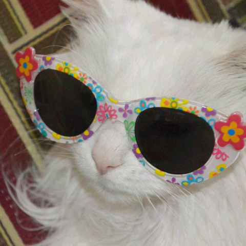
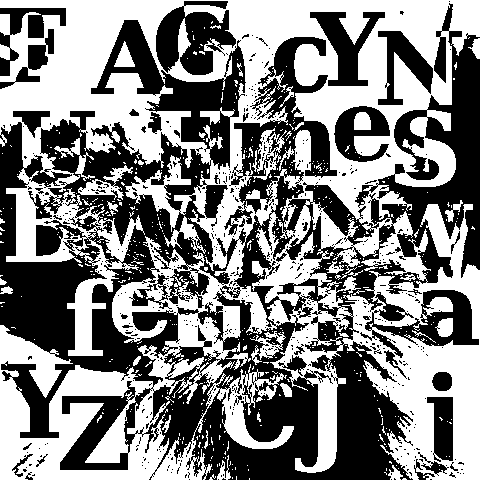
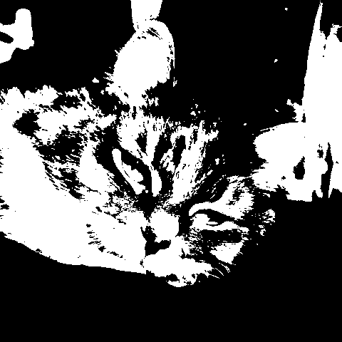
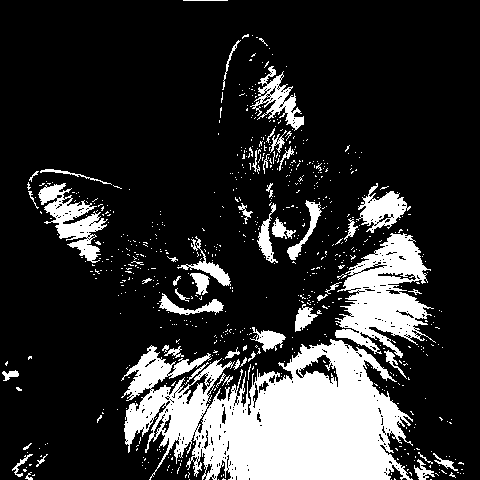
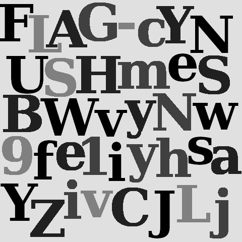

# Crazy Cat Lady

## Challenge Details 

- **CTF:** RingZer0
- **Category:** Steganography
- **Points:** 3

## Provided Materials

- Image:




## Solution

We will first analyze the image with [Stegsolve](https://wiki.bi0s.in/steganography/stegsolve/) *(analyze images in different planes)*. And we notice, that it has some hidden images in all three planes:

- Red plane 2:

	
	
- Green plane 2:

	
	
- Blue plane 2:

	
	
Moreover, it contains some "viewable" images in all planes 0-2, so what we can do is try to extract all those planes *(retain the values of the 0th, 1st, and 2nd [least significant bits](https://medium.com/swlh/lsb-image-steganography-using-python-2bbbee2c69a2) and set all other bits to 0)*. But we also notice, that the images from green and blue planes are blocking us to view the text on the red plane, so we can `xor` all three images, to get the hidden text.

We will use `python` script for that:

```python
from PIL import Image

def extract_hidden_value(pixel_data, index):
    """
    Extracts a hidden value from RGB pixel data.
    
    Args:
    pixel_data: A byte array of pixel data.
    index: Index of the pixel being processed.
    
    Returns:
    An integer representing the extracted hidden value.
    """
    # Extract RGB components
    """
    pixel_data[index * 3] and `111` in binary
    This is often done to extract a specific part 
    of the data stored in the pixel, such as a hidden message, 
    by isolating the least significant bits of the color values.
    """
    red = pixel_data[index * 3] & 7
    green = pixel_data[index * 3 + 1] & 7
    blue = pixel_data[index * 3 + 2] & 7

    # Perform bitwise XOR on RGB components and shift left by 5
    hidden_val = (red ^ green ^ blue) << 5
    return hidden_val

# Load the image
with Image.open("./file.png") as original_image:
    width, height = original_image.size
    original_pixels = original_image.tobytes()

# Process each pixel to extract hidden values
processed_pixels = [extract_hidden_value(original_pixels, i) for i in range(width * height)]

# Create a new image with the processed data
with Image.frombytes("L", (width, height), bytes(processed_pixels)) as new_image:
    new_image.save("./solution.png")
```

Output:




## Final Flag

`FLAG-cYNUSHmeSBWvyNw9fe1iyhsaYZivCJLj`

*Created by [bu19akov](https://github.com/bu19akov)*

