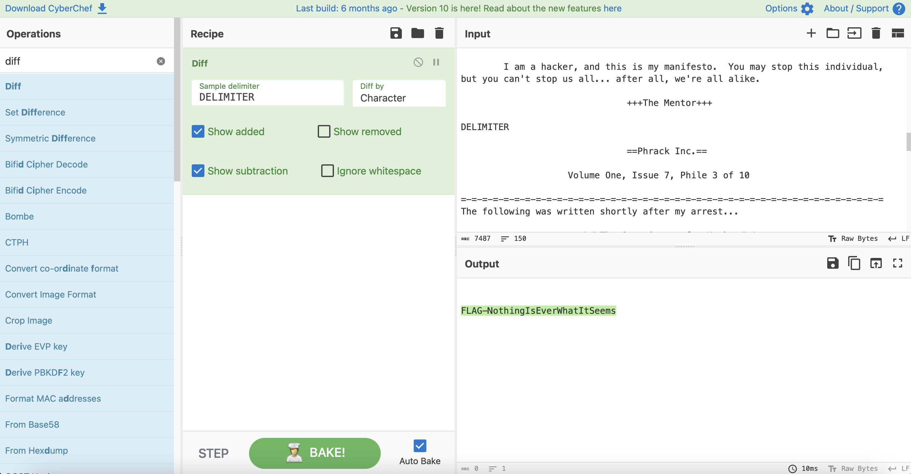

# Hidden In Plain Sight

## Challenge Details 

- **CTF:** RingZer0
- **Category:** Steganography
- **Points:** 2

## Provided Materials

- Text file

## Solution

By analyzing the lines we can notice, that the `hex` representation (left side) and the real text (right side) differ:

```sh
20 20 20 20 20 20 20 20 20 20 20 20 20 62 79 0a                 by 
0a 20 20 20 20 20 20 20 20 20 20 20 20 20 46 20                                        
```

On the second line we can notice `hex` representation `46` (letter `F` in text), but we couldn't see any letter on the text side.

*(By the way, we can find this [article](http://phrack.org/issues/7/3.html) in Google.)*

So we can extract all the hex values from the file, convert them to text and compare with the initial text *(with [CyberChef](https://cyberchef.io))*:

```sh
cat file.txt | cut -c-47 | tr -d "\n" | xxd -r -p > output.txt
```



## Final Flag

`FLAG-NothingIsEverWhatItSeems`

*Created by [bu19akov](https://github.com/bu19akov)*

