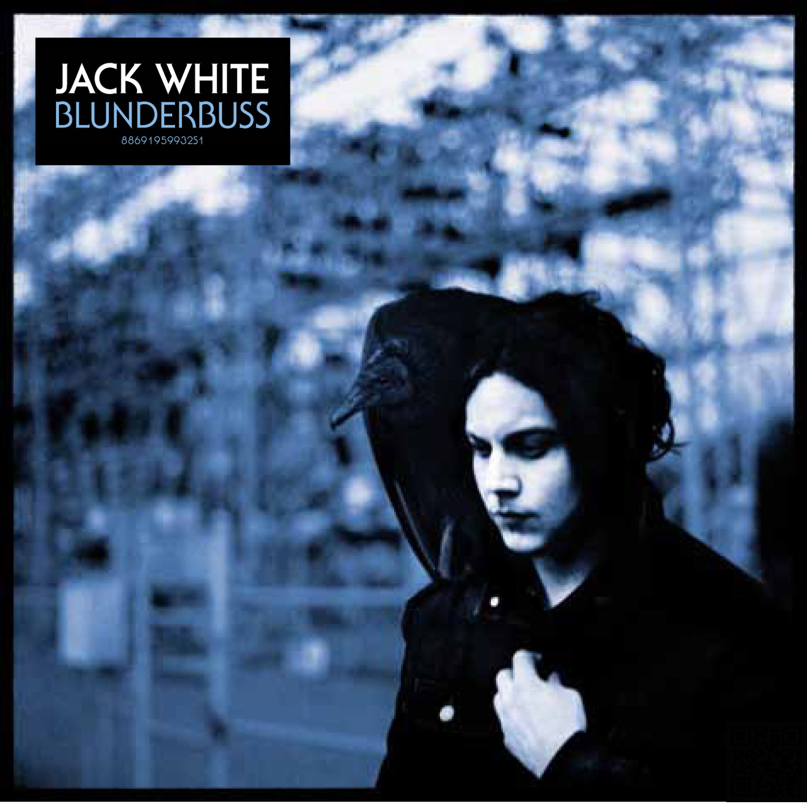

# Missing Pieces

## Challenge Details 

- **CTF:** RingZer0
- **Category:** Steganography
- **Points:** 2

## Provided Materials

- Image:

## Solution

We can analyze the image with [stegsolve](https://wiki.bi0s.in/steganography/stegsolve/) *(used to analyze images in different planes)*. On `Red Plane 1` we can see a QR-code in the right lower corner:

When we scan it, we get our flag.

## Final Flag

`flag-517qBd4tesUTUomYdz7W`

*Created by [bu19akov](https://github.com/bu19akov)*

