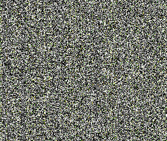
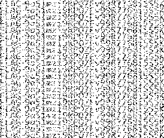

# Pixel Everywhere

## Challenge Details 

- **CTF:** RingZer0
- **Category:** Steganography
- **Points:** 2

## Provided Materials

- Image:



## Solution

We start to analyze the image with [stegsolve](https://wiki.bi0s.in/steganography/stegsolve/) *(analyze images in different planes)* and noticed, that there are some probably readable text in `Gray bits` mode:



There are 21 lines in total, so we can use `python` to split this image in 21 equals images and then combine them all with `and` operator (before that we need to make `images` directory:

```python
from PIL import Image, ImageChops
import os

def split_image(image_path, output_folder):
    # Load the original image
    original_image = Image.open(image_path)

    # Calculate the height of each slice (there are total 21 lines with pixels)
    total_height = original_image.height
    slice_height = total_height // 21

    # Split the image into 21 horizontal slices and save each slice
    for i in range(21):
        top = i * slice_height
        # Adjust the bottom for the last slice to account for any rounding errors
        bottom = (i + 1) * slice_height if i < 20 else total_height

        # Create and save each slice
        slice = original_image.crop((0, top, original_image.width, bottom))
        slice.save(f"{output_folder}/slice_{i + 1}.bmp")

def combine_images_with_and(input_folder, output_image_path):
    # List all the image files in the input folder
    image_files = [f for f in os.listdir(input_folder) if f.endswith('.bmp')]

    # Initialize a variable to store the combined image
    combined_image = None

    # Iterate over all image files
    for filename in image_files:
        # Load the image
        image_path = os.path.join(input_folder, filename)
        image = Image.open(image_path)

        # Convert image to 1-bit mode
        image = image.convert('1')

        # If the combined image hasn't been initialized, use the first image
        if combined_image is None:
            combined_image = image
        else:
            # Apply bitwise AND operation
            combined_image = ImageChops.logical_and(combined_image, image)

    # Save the final combined image
    combined_image.save(output_image_path)

# Usage
image_path = './gray_bits.bmp'  # Replace with your image path
output_folder = './images'  # Replace with your desired output folder path
final_image_path = './final_combined_image.bmp'  # Path for the final combined image

split_image(image_path, output_folder)
combine_images_with_and(output_folder, final_image_path)
```

The final image looks as follows:


## Final Flag

`FLAG-9a51mzi9RPO7Fv99R7768i5S5K`

*Created by [bu19akov](https://github.com/bu19akov)*
