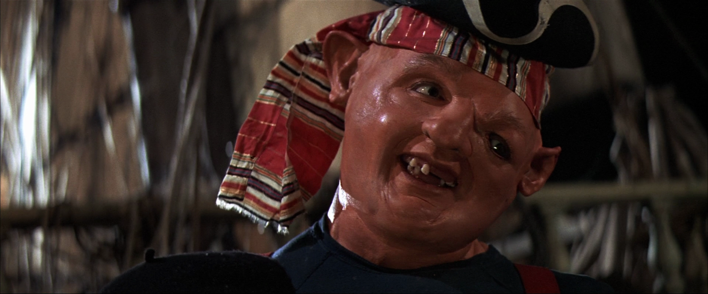
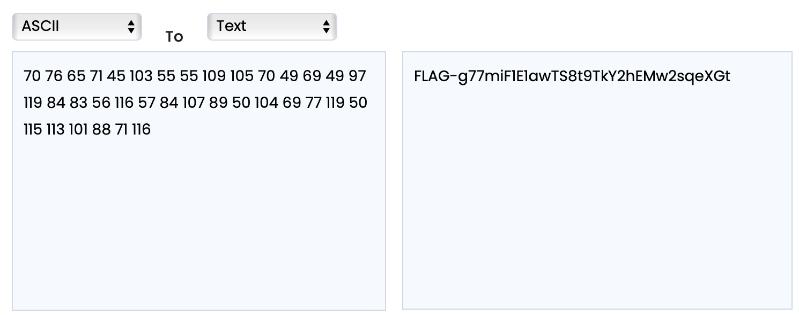

# The Sloth

## Challenge Details 

- **CTF:** RingZer0
- **Category:** Steganography
- **Points:** 2

## Provided Materials

- Image:



## Solution

- **First Method:**

	For the first approach we will be using [pngcheck](http://www.libpng.org/pub/png/apps/pngcheck.html) *(it can optionally dump almost all of the chunk-level information in the image in human-readable form)*. 
	
	```sh
	Options:
		-c  colorize output (for ANSI terminals)
		-v  test verbosely (print most chunk data)
		...
	```
	
	So we use `pngcheck` with `-cv` flag:
	
	```sh
	pngcheck -cv file.png            
		File: file.png (2264689 bytes)
		  chunk IHDR at offset 0x0000c, length 13
		    1920 x 800 image, 24-bit RGB, non-interlaced
		  chunk IDAT at offset 0x00025, length 70
		    zlib: deflated, 32K window, default compression
		  chunk IDAT at offset 0x00077, length 76
		  chunk IDAT at offset 0x000cf, length 65
		  chunk IDAT at offset 0x0011c, length 71
		  chunk IDAT at offset 0x0016f, length 45
		  chunk IDAT at offset 0x001a8, length 103
		  chunk IDAT at offset 0x0021b, length 55
		  chunk IDAT at offset 0x0025e, length 55
		  chunk IDAT at offset 0x002a1, length 109
		  chunk IDAT at offset 0x0031a, length 105
		  chunk IDAT at offset 0x0038f, length 70
		  chunk IDAT at offset 0x003e1, length 49
		  chunk IDAT at offset 0x0041e, length 69
		  chunk IDAT at offset 0x0046f, length 49
		  chunk IDAT at offset 0x004ac, length 97
		  chunk IDAT at offset 0x00519, length 119
		  chunk IDAT at offset 0x0059c, length 84
		  chunk IDAT at offset 0x005fc, length 83
		  chunk IDAT at offset 0x0065b, length 56
		  chunk IDAT at offset 0x0069f, length 116
		  chunk IDAT at offset 0x0071f, length 57
		  chunk IDAT at offset 0x00764, length 84
		  chunk IDAT at offset 0x007c4, length 107
		  chunk IDAT at offset 0x0083b, length 89
		  chunk IDAT at offset 0x008a0, length 50
		  chunk IDAT at offset 0x008de, length 104
		  chunk IDAT at offset 0x00952, length 69
		  chunk IDAT at offset 0x009a3, length 77
		  chunk IDAT at offset 0x009fc, length 119
		  chunk IDAT at offset 0x00a7f, length 50
		  chunk IDAT at offset 0x00abd, length 115
		  chunk IDAT at offset 0x00b3c, length 113
		  chunk IDAT at offset 0x00bb9, length 101
		  chunk IDAT at offset 0x00c2a, length 88
		  chunk IDAT at offset 0x00c8e, length 71
		  chunk IDAT at offset 0x00ce1, length 116
		  chunk IDAT at offset 0x00d61, length 2261244
		  chunk IEND at offset 0x228e69, length 0
		No errors detected in file.png (39 chunks, 50.9% compression).
	```
	
	We see, that all chunk lengths are valid [ASCII](https://upload.wikimedia.org/wikipedia/commons/1/1b/ASCII-Table-wide.svg) characters.
	
	So we can convert them to text format:
	
	
	
- **Second Method:**

	When we have analyzed file with [strings](https://man7.org/linux/man-pages/man1/strings.1.html) *(print the strings of printable characters in files)*, we noticed, that there are letters that preceed [IDAT](http://www.libpng.org/pub/png/spec/1.2/PNG-Chunks.html) chunks:
	
	```sh
	strings file.png | head
		IHDR
		FIDATx
			F0	
		"	F0
		LIDAT~
		AIDAT
		GIDAT
		G[gG
		-IDAT
		zz6<
	```
	
	So we can extract all lines that contain the word `IDAT` and then extract the first character from this line:
	
	```sh
	strings file.png | grep -i ".idat" | cut -c-1 | tr -d "\n"
		FLAG-g77miF1E1awTS8t9TkY2hEMw2sqeXGt
	```
	
	*Here you can read more about the used commands: [grep](https://man7.org/linux/man-pages/man1/grep.1.html), [cut](https://man7.org/linux/man-pages/man1/cut.1.html), [tr](https://man7.org/linux/man-pages/man1/tr.1.html)*
	

## Final Flag

`FLAG-g77miF1E1awTS8t9TkY2hEMw2sqeXGt`

*Created by [bu19akov](https://github.com/bu19akov)*

