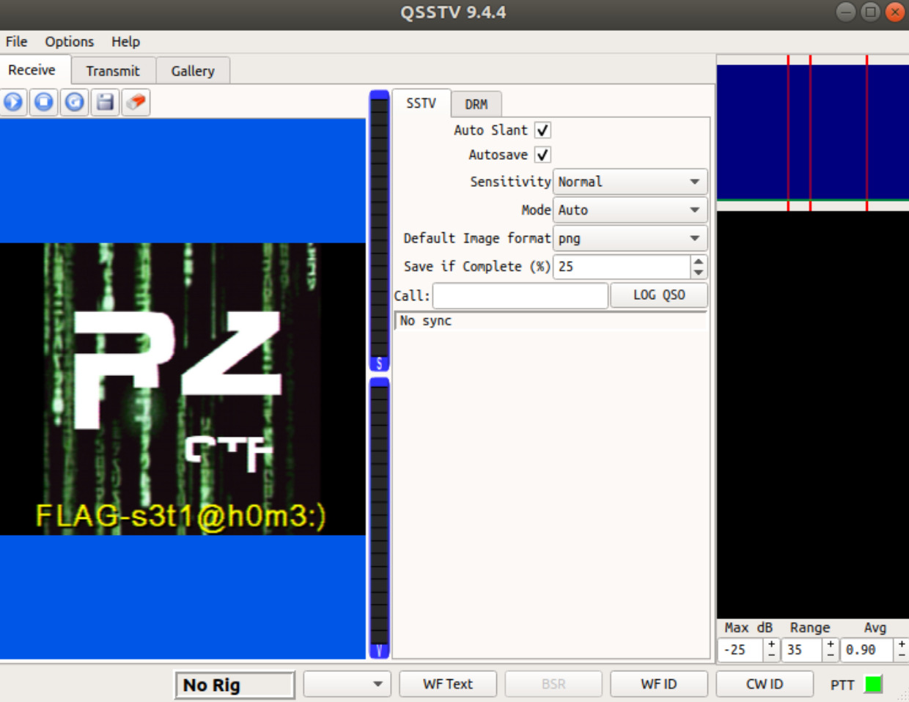

# The vestige of dial-up Internet

## Challenge Details 

- **CTF:** RingZer0
- **Category:** Steganography
- **Points:** 2

## Provided Materials

- Audio file

## Solution

We have an audio file that sounds like an old dial-up modem. So all we have to do is to decode the audio file with some [SSTV](https://en.wikipedia.org/wiki/Slow-scan_television) *(picture transmission method)* decoding software. I personally have used [JVCOMM32](http://www.jvcomm.de/dlframee.html) on my Virtual Windows Machine, but there are also alternatives for Android ([Robot36](https://play.google.com/store/apps/details?id=xdsopl.robot36)) and IOS ([SSTV Slow Scan TV](https://apps.apple.com/us/app/sstv-slow-scan-tv/id387910013)). So here is the image, that we got:

## Final Flag

`FLAG-s3t1@h0m3:)`

*Created by [bu19akov](https://github.com/bu19akov)*

