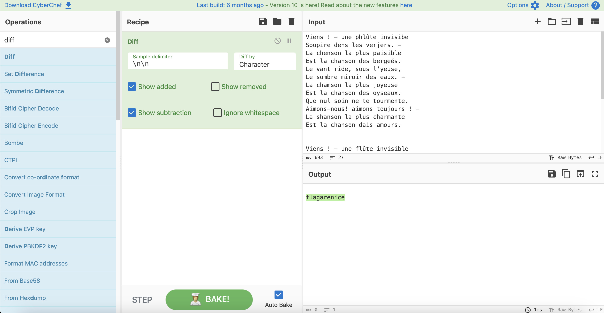

# Victor reloaded

## Challenge Details 

- **CTF:** RingZer0
- **Category:** Steganography
- **Points:** 2

## Provided Materials

- Piece of text:

```
Viens ! - une phlûte invisibe
Soupire dens les verjers. -
La chenson la plus paisible
Est la chanson des bergeés.

Le vant ride, sous l'yeuse,
Le sombre miroir des eaux. -
La chamson la plus joyeuse
Est la chanson des oyseaux.

Que nul soin ne te tourmente.
Aimons-nous! aimons toujours ! -
La shanson la plus charmante
Est la chanson dais amours.
```


## Solution

The first thing we will do is to google this text. This gives us very similar [poem](https://www.bonjourpoesie.fr/lesgrandsclassiques/Poemes/victor_hugo/viens_-_une_flute_invisible). 

But we can see, that some characters are differ.

So for that we will use [CyberChef](https://cyberchef.io) *(a web app for encryption, encoding, compression and data analysis)* with `diff` *(display the differences)*.



**here is [link](https://gchq.github.io/CyberChef/#recipe=Diff('%5C%5Cn%5C%5Cn','Character',true,false,true,false)&input=VmllbnMgISAtIHVuZSBwaGz7dGUgaW52aXNpYmUKU291cGlyZSBkZW5zIGxlcyB2ZXJqZXJzLiAtCkxhIGNoZW5zb24gbGEgcGx1cyBwYWlzaWJsZQpFc3QgbGEgY2hhbnNvbiBkZXMgYmVyZ2Xpcy4KTGUgdmFudCByaWRlLCBzb3VzIGwneWV1c2UsCkxlIHNvbWJyZSBtaXJvaXIgZGVzIGVhdXguIC0KTGEgY2hhbXNvbiBsYSBwbHVzIGpveWV1c2UKRXN0IGxhIGNoYW5zb24gZGVzIG95c2VhdXguClF1ZSBudWwgc29pbiBuZSB0ZSB0b3VybWVudGUuCkFpbW9ucy1ub3VzISBhaW1vbnMgdG91am91cnMgISAtCkxhIHNoYW5zb24gbGEgcGx1cyBjaGFybWFudGUKRXN0IGxhIGNoYW5zb24gZGFpcyBhbW91cnMuCgoKVmllbnMgISAtIHVuZSBmbPt0ZSBpbnZpc2libGUKU291cGlyZSBkYW5zIGxlcyB2ZXJnZXJzLiAtCkxhIGNoYW5zb24gbGEgcGx1cyBwYWlzaWJsZQpFc3QgbGEgY2hhbnNvbiBkZXMgYmVyZ2Vycy4KTGUgdmVudCByaWRlLCBzb3VzIGwneWV1c2UsCkxlIHNvbWJyZSBtaXJvaXIgZGVzIGVhdXguIC0KTGEgY2hhbnNvbiBsYSBwbHVzIGpveWV1c2UKRXN0IGxhIGNoYW5zb24gZGVzIG9pc2VhdXguClF1ZSBudWwgc29pbiBuZSB0ZSB0b3VybWVudGUuCkFpbW9ucy1ub3VzISBhaW1vbnMgdG91am91cnMgISAtCkxhIGNoYW5zb24gbGEgcGx1cyBjaGFybWFudGUKRXN0IGxhIGNoYW5zb24gZGVzIGFtb3Vycy4K) with predefined recipe**

## Final Flag

`flagarenice`

*Created by [bu19akov](https://github.com/bu19akov)*

