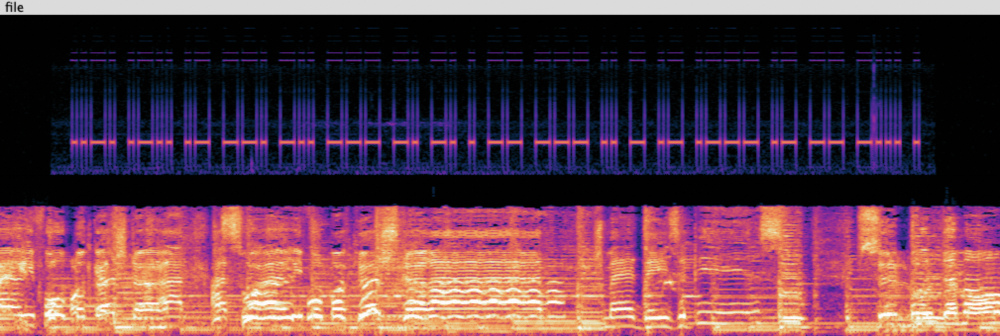
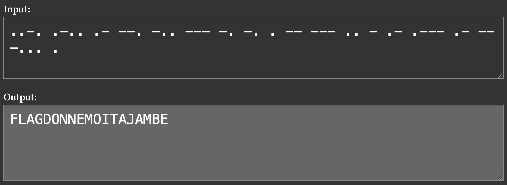

# Your old friend Orloge Simard

## Challenge Details 

- **CTF:** RingZer0
- **Category:** Steganography
- **Points:** 3

## Provided Materials

- Audio file

## Solution

When we listen to the gived `audio file` we can hear, that it is playing backwards. So with [Audacity](https://www.audacityteam.org) *(audio editing and recording app*), we can [reverse](https://manual.audacityteam.org/man/reverse.html) the `audio file`.

Then by analyzing audio's [spectogram](https://manual.audacityteam.org/man/spectrogram_view.html#:~:text=To%20select%20Spectrogram%20view%2C%20click,required%20view%20can%20be%20selected..) we can notice something similar to [Morse code](https://en.wikipedia.org/wiki/Morse_code) on the left channel:

So we can try to use [Morse code translator](https://morsecode.world/international/translator.html) and indeed, this gives us our `flag`:

## Final Flag

`FLAGDONNEMOITAJAMBE`

*Created by [bu19akov](https://github.com/bu19akov)*

