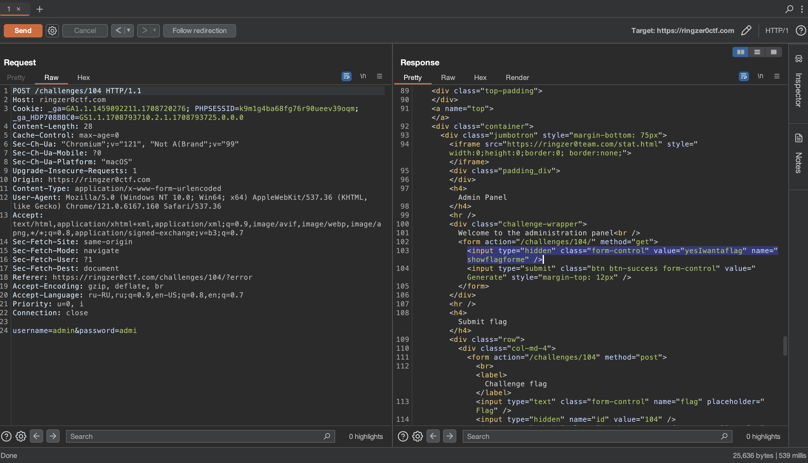
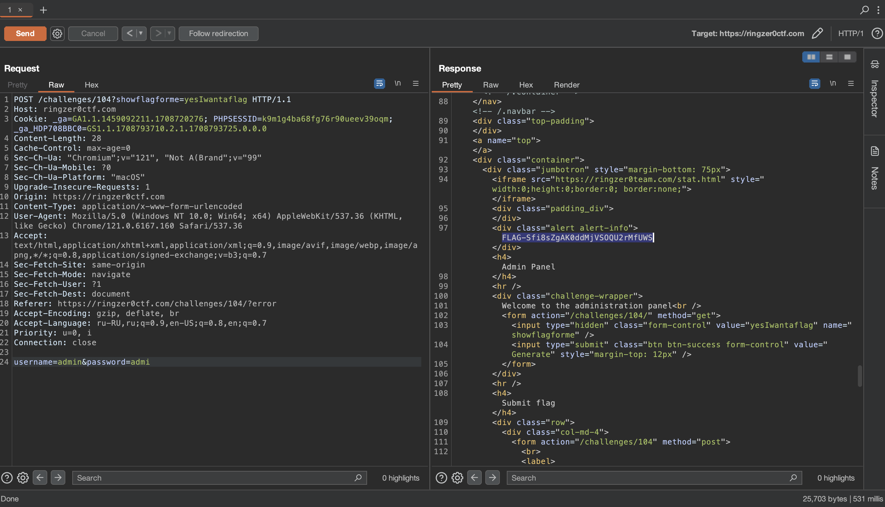

# Admin Portal

## Challenge Details 

- **CTF:** RingZer0
- **Category:** Web Warning
- **Points:** 2

## Provided Materials

- Login form

## Solution

We can analyze our request with [Burp Suite](https://portswigger.net/burp/communitydownload):

When we send random login/pasword, we get the admin page, but the browser doesn't render it and send to us `Wrong username / password` message. But we can see, that there is input with the name `showflagforme`, so we can just send request to `/challenges/104?showflagforme=yesIwantaflag`, that will show us our flag:

## Final Flag

`FLAG-Sfi8sZgAK0ddMjVSOQU2rMfUWS`

*Created by [bu19akov](https://github.com/bu19akov)*