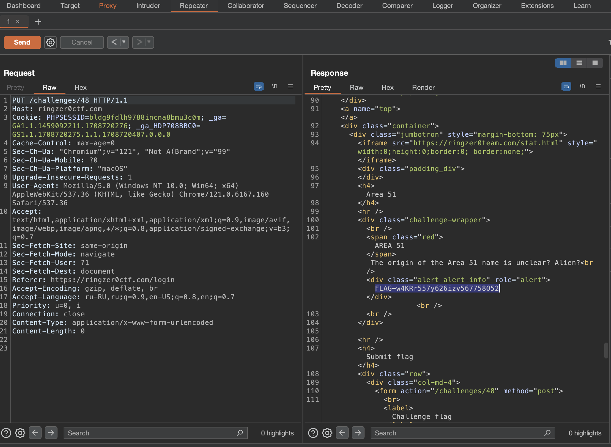

# Area 51

## Challenge Details 

- **CTF:** RingZer0
- **Category:** Web Warning
- **Points:** 1

## Provided Materials

- Text `Access to this area is restricted using some secure .htaccess`

## Solution

`.htaccess` can [control request methods](https://htaccessbook.com/control-request-methods/), so if we send our request using `PUT` request, we get our flag *(We can use [Burp Suite](https://portswigger.net/burp/communitydownload) for that)*:

## Final Flag

`FLAG-w4KRr557y626izv567758O52`

*Created by [bu19akov](https://github.com/bu19akov)*