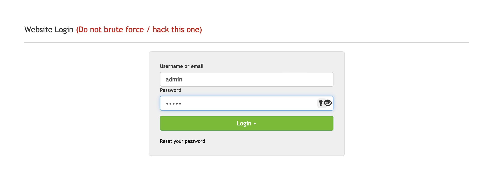
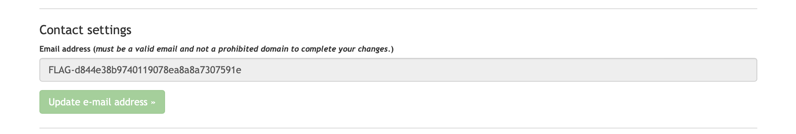

# Hacking skill are optional

## Challenge Details 

- **CTF:** RingZer0
- **Category:** Web Warning
- **Points:** 1

## Provided Materials

- [Link](https://www.itgovernance.co.uk/blog/63-of-data-breaches-involve-weak-default-or-stolen-passwords)

## Solution

The link is about weak passwords and the challenge name is `Hacking skill are optional`, so probably we need to login with the most weak username/password combination to [RingZer0](https://ringzer0ctf.com/login):

The combination is `admin:admin`. Once we are logged in, we can find flag in admin's profile:

## Final Flag

`FLAG-d844e38b9740119078ea8a8a7307591e`

*Created by [bu19akov](https://github.com/bu19akov)*