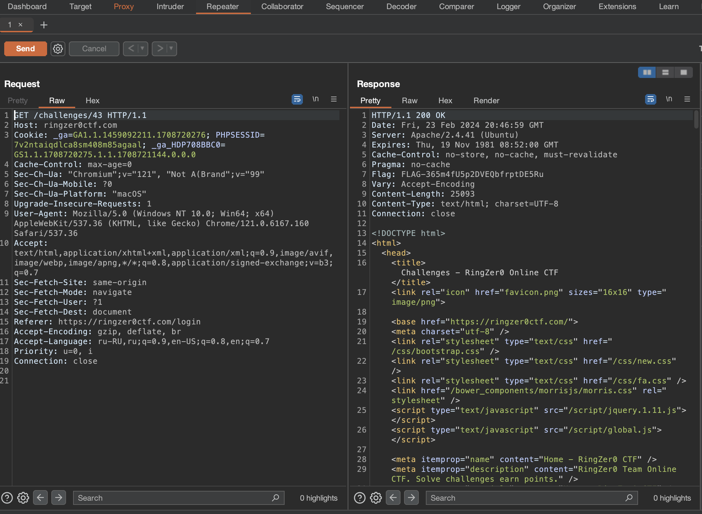

# Headache

## Challenge Details 

- **CTF:** RingZer0
- **Category:** Web Warning
- **Points:** 1

## Provided Materials

- Text `Answer is closer than you think!`

## Solution

As the name is `Headache`, probably the flag will be in page headers... Let's look at it using `Burp Suite`:

And indeed, flag is in the header `Flag`.

## Final Flag

`FLAG-365m4fU5p2DVEQbfrptDE5Ru`

*Created by [bu19akov](https://github.com/bu19akov)*