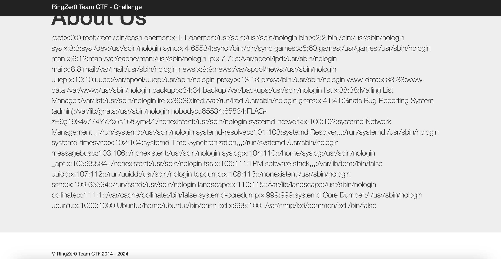

# Looking for password file

## Challenge Details 

- **CTF:** RingZer0
- **Category:** Web Warning
- **Points:** 1

## Provided Materials

- Web page [http://challenges.ringzer0team.com:10075/?page=lorem.php#](http://challenges.ringzer0team.com:10075/?page=lorem.php#)

## Solution

As the challenge name suggest, we should look for password file. Also with the link we can directly spot [LFI vulnerability](https://www.vaadata.com/blog/exploiting-an-lfi-local-file-inclusion-vulnerability-and-security-tips/). So we can open [http://challenges.ringzer0team.com:10075/?page=/etc/passwd](http://challenges.ringzer0team.com:10075/?page=/etc/passwd) and see our flag:

## Final Flag

`FLAG-zH9g1934v774Y7Zx5s16t5ym8Z`

*Created by [bu19akov](https://github.com/bu19akov)*