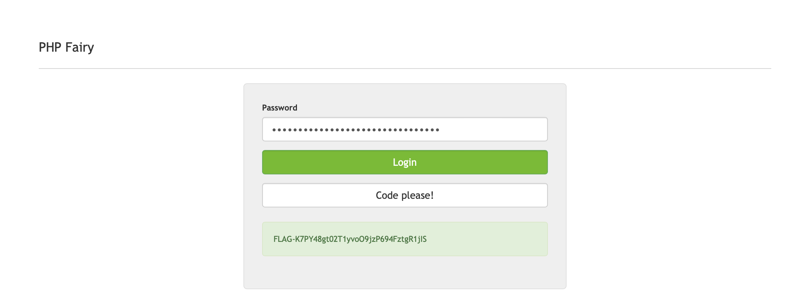

# PHP Fairy

## Challenge Details 

- **CTF:** RingZer0
- **Category:** Web Warning
- **Points:** 2

## Provided Materials

- Code:

```php
<?php
$output = "";
if (isset($_GET['code'])) {
  $content = file_get_contents(__FILE__);
  $content = preg_replace('/FLAG\-[0-9a-zA-Z_?!.,]+/i', 'FLAG-XXXXXXXXXXXXXXXXXXXXXXX', $content);
  echo '<div class="code-highlight">';
  highlight_string($content);
  echo '</div>';
}

if (isset($_GET['pass'])) {
  if(!preg_match('/^[^\W_]+$/', $_GET['pass'])) {
    $output = "Don't hack me please :(";
  } else {

    $pass = md5("admin1674227342");
    if ((((((((($_GET['pass'] == $pass)))) && (((($pass !== $_GET['pass']))))) || ((((($pass == $_GET['pass'])))) && ((($_GET['pass'] !== $pass)))))))) { // Trolling u lisp masta
      if (strlen($pass) == strlen($_GET['pass'])) {
        $output = "<div class='alert alert-success'>FLAG-XXXXXXXXXXXXXXXXXXXXXXX</div>";
      } else {
        $output = "<div class='alert alert-danger'>Wrong password</div>";
      }
    } else {
      $output = "<div class='alert alert-danger'>Wrong password</div>";
    }
  }
}
?>
```

## Solution

The code snippet uses `MD5` to generate a hash for `admin1674227342`, resulting in `0e463854177790028825434984462555`. Due to PHP's `==` operator treating `e` as an exponent, `0e463...` is considered as `0`. The first condition checks if the MD5 hash equals `$_GET['pass']`, which can be true if `$_GET['pass']` is also interpreted as 0. However, `$_GET['pass']` must be a different type *(number vs. string)* to satisfy `$pass !== $_GET['pass']`.

To bypass this, we can submit a string of 32 zeros. This string satisfies both conditions: it's interpreted as `0` *(matching the MD5 hash)* and has a different type *(string vs. number)*, thus revealing the flag. The trick lies in exploiting PHP's type juggling and the specific behavior of the `==` operator:



## Final Flag

`FLAG-K7PY48gt02T1yvoO9jzP694FztgR1jIS`

*Created by [bu19akov](https://github.com/bu19akov)*