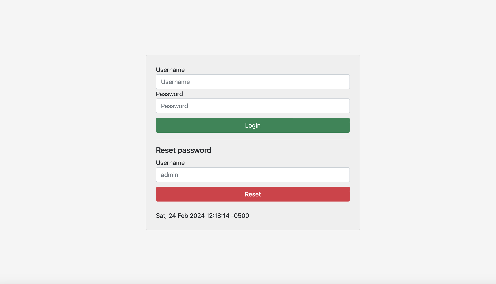
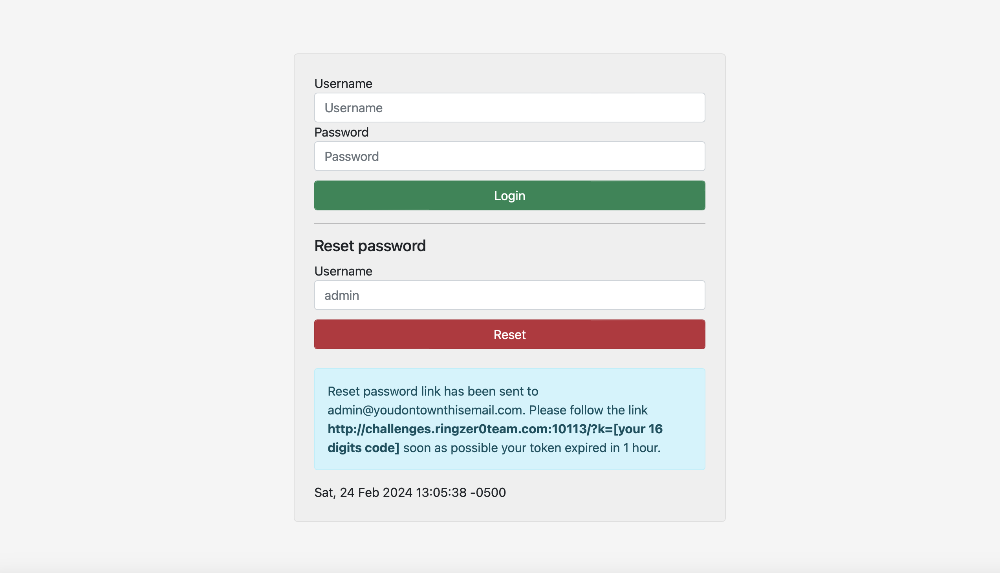
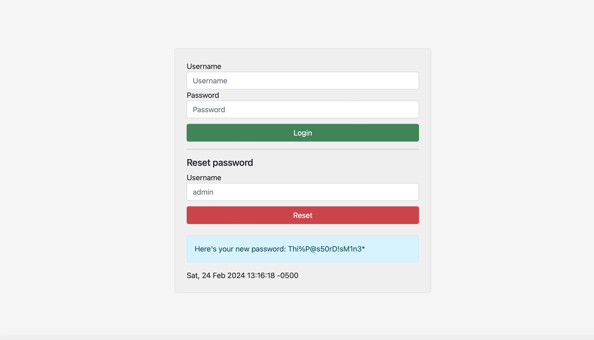
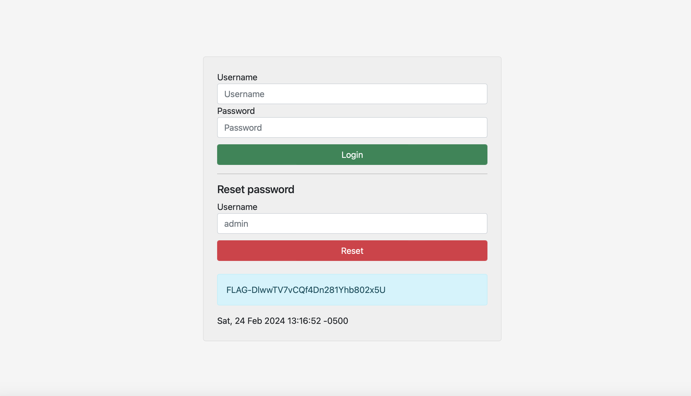

# Password reset

## Challenge Details 

- **CTF:** RingZer0
- **Category:** Web Warning
- **Points:** 2

## Provided Materials

- Web form:



- Code:

```php
if(isset($_POST['reset_username'])) {
		srand(time());
		$token =
		rand(1000000000000000,9999999999999999);
				
		$success = '<div class="success">Reset password link has been sent to admin@youdontownthisemail.com. Please follow the link ...
		$hSql->FastQuery('DELETE FROM chal_113 WHERE ip_addr = ?', array($_SERVER['REMOTE_ADDR']));
		$hSql->FastQuery('insert into chal_113 values (?,?,?)', array($_SERVER['REMOTE_ADDR'], $token, time() + 3600));
}

if(URL_HANDLE::GetInstance()->get->k != null) {
		$result = reset($hSql->FastQuery('SELECT * FROM chal_113 WHERE ip_addr = ? AND recovery_key = ? ', array($_SERVER['REMOTE_ADDR'], URL_HANDLE::GetInstance()->get->k)));
		if($hSql->RowCount() != 0) {
				if($result->expired_time > time()) {
						$success = '<div class="success">Here\'s your new password: XXXXXXXXXXXXXX</div>';
				} else {
						$success = '<div class="error">Expired recovery key!</div>';
				}
		} else {
				$success = '<div class="error">Invalid recovery key!</div>';
		}
}
```

## Solution

PHP's [time()](https://www.w3schools.com/php/func_date_time.asp) function returns the current time in the number of seconds since the Unix Epoch.

The token is created by `rand(...)` function. For the same seed, this function gives the same number.

In our case the seed is the time, that we can see on the page, when trying to reset the password:



So we can write following `PHP` script to get our recovery key from the time:

```php
<?php
srand(strtotime("Sat, 24 Feb 2024 13:05:38 -0500"));
echo rand(1000000000000000,9999999999999999);
?>
```

But also we need to use `PHP 5.0.5` version, so we can use [this](https://onlinephp.io) website for that.

This gives us our recovery key, and when we make request to `http://challenges.ringzer0team.com:10113/?k={recovery key}`, we can see our password:



`Thi%P@s50rD!sM1n3*`

And when we login as admin with that password, we get our flag:



## Final Flag

`FLAG-DlwwTV7vCQf4Dn281Yhb802x5U`

*Created by [bu19akov](https://github.com/bu19akov)*