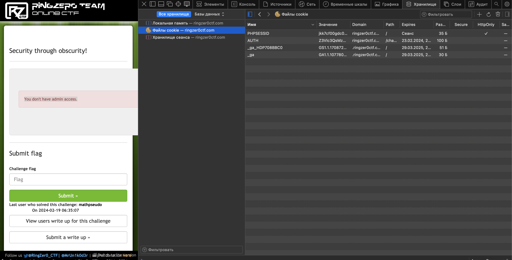
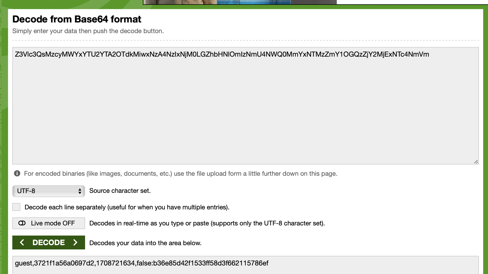
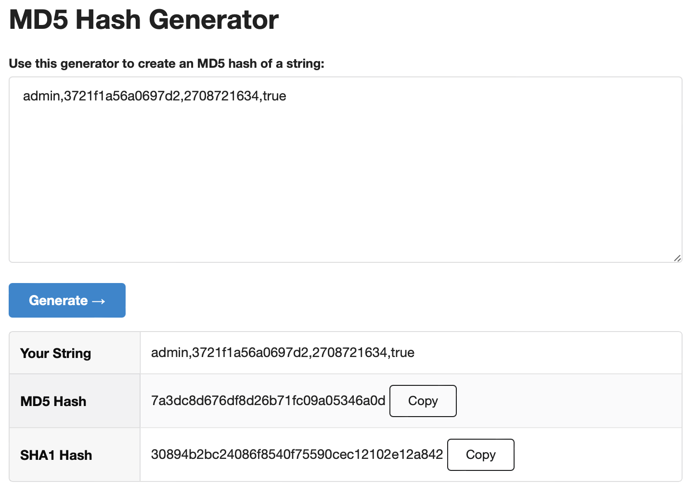
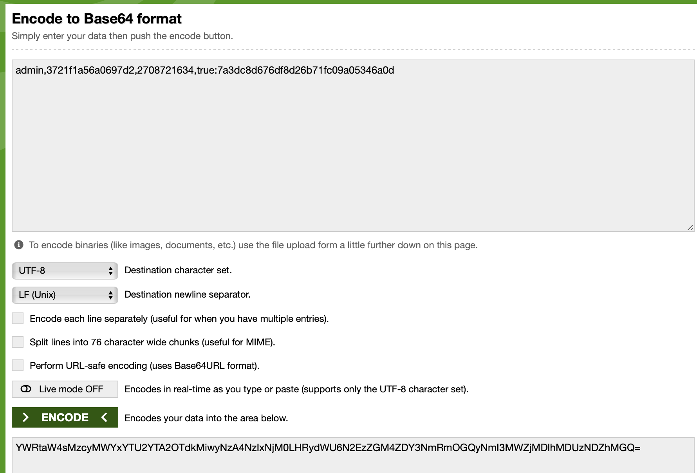
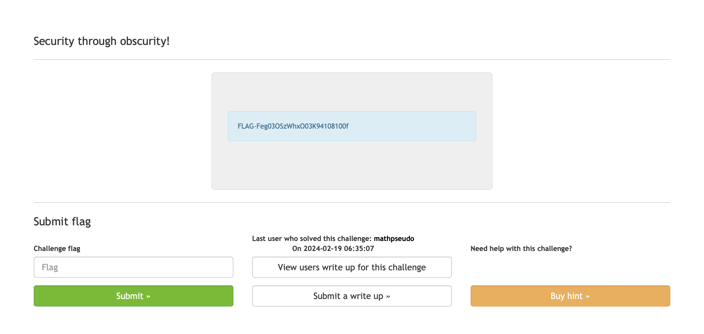

# Security thru obscurity!

## Challenge Details 

- **CTF:** RingZer0
- **Category:** Web Warning
- **Points:** 2

## Provided Materials

- Text `You don't have admin access.`

## Solution

We need to get admin access. By analyzing cookies, we can find `AUTH` cookie:



It's value looks like `base64` encoded string, so let's try to decode it [here](https://www.base64decode.org):



So, let's break it down:

```
guest = name
3721f1a56a0697d2 = salt value
1708721634 = time stamp
false = boolean value
b36e85d42f1533ff58d3f662115786ef = MD5 hash of "guest,3721f1a56a0697d2,1708721634,false"
```

All we need to do, is to change `guest` to `admin`, `false` to `true` and make the timestamp value bigger, so our cookie won't get expired.

So, firstly we create `MD5` hash of our new string [here](https://www.md5hashgenerator.com):

 

Then, we encode it with `base64` [here](https://www.base64encode.org):



And finally we need to replace our `AUTH` cookie with newly generated value and refresh the page:



## Final Flag

`FLAG-Feg03OSzWhxO03K94108100f`

*Created by [bu19akov](https://github.com/bu19akov)*