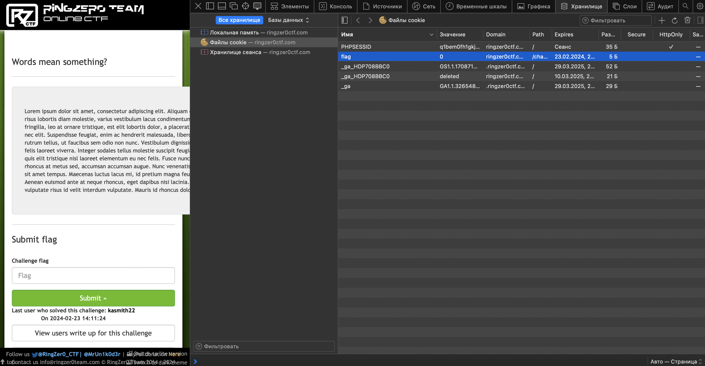
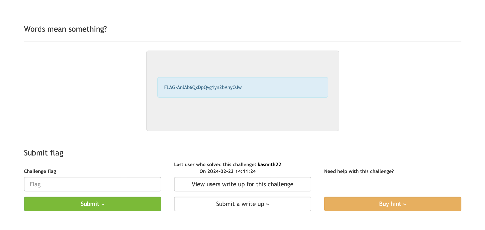

# Words mean something?

## Challenge Details 

- **CTF:** RingZer0
- **Category:** Web Warning
- **Points:** 1

## Provided Materials

- Text `Lorem ipsum dolor sit amet...`

## Solution

As it is in `WEB` category, firstly we need to check our cookies:

We found `flag` cookie with value `0`, so if we set it to `1` and refresh the page, we will get our flag:

## Final Flag

`FLAG-AnlAb6QxDpQvg1yn2bAhyOJw`

*Created by [bu19akov](https://github.com/bu19akov)*